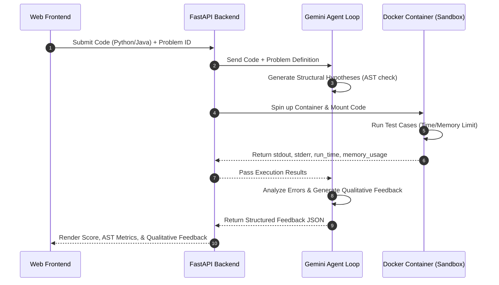
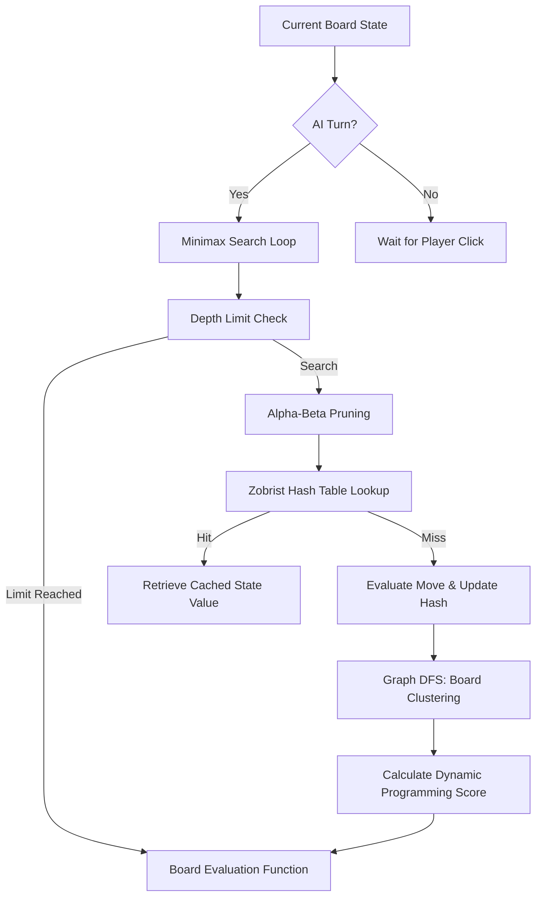
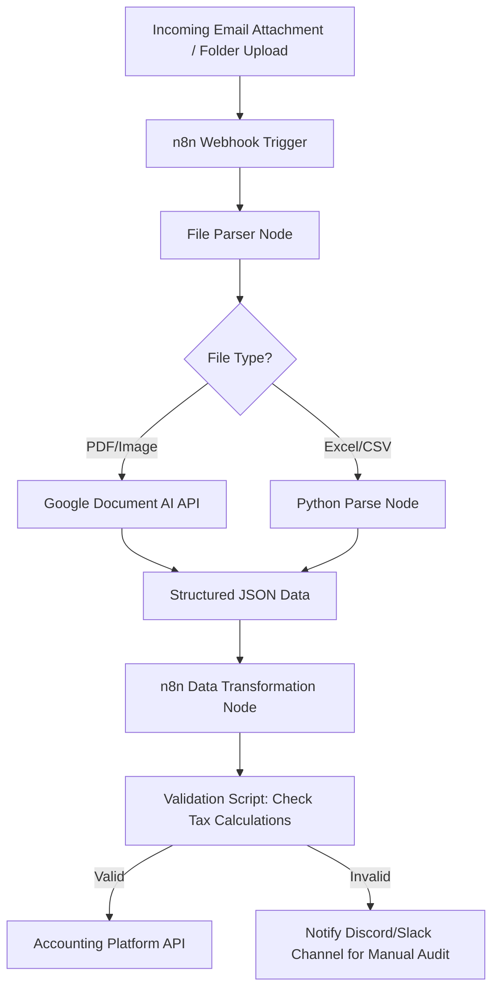

# Technical Deep Dives — Kankatala Ganesh Giridhar

This document contains detailed technical breakdowns of my core projects, focusing on system architecture, algorithmic optimizations, and design trade-offs. It is structured for deep technical reviews and interview prep.

---

## 1. RiceAgent Pro: Offline-First Synchronization Architecture

### System Context
RiceAgent Pro is a business automation platform for a large-scale rice distribution business in Andhra Pradesh. The primary operational constraint is poor or non-existent cellular connectivity in rural warehouses and during transport.

### High-Level Architecture
```mermaid
graph TD
    subgraph Client Application (Flutter)
        UI[Flutter UI Layer]
        RP[Riverpod State Provider]
        DF[Drift SQLite ORM]
        DB[(Local SQLite File)]
        SQ[Sync Queue Table]
    end

    subgraph Synchronization Boundary
        SC[Sync Controller]
        NET[Network Monitor]
    end

    subgraph Backend Server (Node.js/Express)
        API[Sync REST API]
        DB_SVR[(PostgreSQL Database)]
    end

    UI --> RP
    RP --> DF
    DF --> DB
    DF --> SQ
    SQ --> SC
    NET -->|Online Event| SC
    SC -->|Post Batch| API
    API -->|Lock & Merge| DB_SVR
    API -->|Sync Status| SC
    SC -->|Update Status| DF
```

### Key Technical Details
1. **Local-First Persistence:** 
   * Built using **Flutter** and **Dart**.
   * Local database layer implemented with **Drift (SQLite)**. SQLite acts as the single source of truth for the client application.
   * State management is handled via **Riverpod**, ensuring unidirectional data flow: `UI Event ➔ Riverpod Provider ➔ Drift Database Mutation ➔ Stream Update ➔ UI Render`.
2. **Synchronization Queue Pattern:**
   * Every write operation (e.g., adding an order, updating inventory, generating a GST bill) writes to both the relevant data table and a `sync_queue` table.
   * The `sync_queue` stores the operation type (INSERT, UPDATE, DELETE), the target table, the row ID, and a JSON payload of the changes, stamped with a sequential transaction number.
3. **Conflict Resolution & Merge Strategy:**
   * **Client-Generated UUIDs:** All database records use UUIDs generated on the client to prevent ID collisions on the server during batch uploads.
   * **Optimistic Offline Writes:** The UI updates instantly, assuming the write will succeed.
   * **Idempotent API Design:** Sync payloads include transaction numbers. If a network drop occurs during a sync request, the client retries the same batch. The server uses the transaction numbers to detect and drop duplicate operations.
   * **Last-Write-Wins (LWW) with Conflict Log:** The server compares incoming records with the central database. If the server has a newer modification timestamp, it logs the conflict and updates the client database with the server version (force sync).

---

## 2. ExecuCode: Sandboxed Code-Grading Agentic Loop

### System Context
ExecuCode is an AI-powered code evaluation environment designed to grade user-submitted code for correctness, performance, and structure. It sandboxes untrusted code execution to protect the host system.

### Grading Pipeline Flow


### Key Technical Details
1. **Sandboxed Code Execution:**
   * Built on a **FastAPI** backend in **Python**.
   * Code submissions are written to temporary files and executed inside isolated, resource-constrained **Docker** containers.
   * Memory is capped at 128MB and CPU execution is limited to 2 seconds using Docker resource flags (`--memory`, `--cpus`).
   * Network access inside the container is disabled (`--network none`) to prevent malicious outbound requests.
2. **Deterministic & Agentic Evaluation:**
   * **Deterministic Layer:** The sandbox runs the code against structured test suites, capturing exact outputs, execution time, and memory usage. A Python-based Abstract Syntax Tree (AST) analyzer inspects the code structure (e.g., checking if the student used recursion or nested loops as required).
   * **Agentic Layer:** A recursive **Gemini API** agent loop takes the raw sandbox output and the AST analysis. If tests failed, the agent executes a sub-loop to pinpoint the exact logical bug and generate a readable hint without revealing the direct solution.

---

## 3. FLIP WARS: Algorithmic Game Engine & State Space Optimization

### Game Mechanics
FLIP WARS is a tile-flipping strategy game played on a grid, built in **Java** and **JavaFX**. The objective is to capture the majority of the board by flipping contiguous clusters of tiles.

### Game Loop & AI Search Tree


### Key Algorithmic Optimizations
1. **Minimax with Alpha-Beta Pruning:**
   * The AI opponent uses a Minimax decision tree to simulate potential moves up to 6 plies deep.
   * Alpha-beta pruning discards branches that are guaranteed to yield worse outcomes than previously evaluated moves, reducing the search space from $O(b^d)$ to approximately $O(b^{d/2})$ in the best case.
2. **Zobrist Hashing for Transposition Tables:**
   * Board states can repeat through different sequences of moves (transpositions).
   * At startup, a unique random 64-bit integer is generated for each possible piece configuration on each board cell.
   * The hash of a board state is computed using bitwise XOR operations on the keys. When a piece is flipped, the hash is updated instantly with: `New_Hash = Old_Hash ^ Key_Old_Piece ^ Key_New_Piece`.
   * Evaluated states are cached in a hash map. If the AI encounters a board state it has already evaluated, it returns the cached score in $O(1)$ time, preventing redundant search tree evaluations.
3. **Graph Clustering (DFS) & Dynamic Programming:**
   * The board evaluation function needs to count contiguous clusters of player tiles. I modeled the grid as a graph and used Depth-First Search (DFS) to find and size connected components.
   * Dynamic programming tracks region values to calculate positional advantages (e.g., corner control vs. vulnerable edge pieces) without recalculating the entire board from scratch on every node evaluation.

---

## 4. Pathway RAG Pipeline: Real-Time Data Streaming & Document Indexing

### System Context
Traditional RAG pipelines index documents in batches, meaning that information added or updated in a source file is not immediately retrievable. This pipeline implements live, streaming document indexing.

### Data Flow
```mermaid
graph LR
    subgraph Data Sources
        FS[Local Filesystem]
        KF[Kafka Topic]
    end

    subgraph Stream Engine (Pathway AI)
        IN[Live File Ingest]
        PL[Streaming Transformer]
        EM[Vector Embeddings Generator]
    end

    subgraph Target Storage
        PG[(PostgreSQL + pgvector)]
        VDB[(Chroma Vector DB)]
    end

    subgraph Query API
        QA[FastAPI Server]
        RER[Re-ranker Model]
    end

    FS --> IN
    KF --> IN
    IN --> PL
    PL --> EM
    EM -->|Upsert Stream| PG
    EM -->|Upsert Stream| VDB
    QA -->|Hybrid Query| PG
    QA -->|Rerank & Query| VDB
```

### Key Technical Details
1. **Streaming Data Ingestion:**
   * Built in **Python** using **Pathway AI**. Pathway maintains a reactive, streaming dataflow graph.
   * The pipeline monitors local folders and listens to a **Kafka** topic. When a file is modified, or a message is published, Pathway processes the diff rather than re-indexing the entire corpus.
2. **Vector DB Upsert Stream:**
   * Text is parsed and chunked using custom regex boundaries.
   * Embeddings are generated using the `text-embedding-3-small` model and sent to **PostgreSQL (pgvector)** and **Chroma DB**.
   * Pathway handles vector upserts (inserting if new, updating if modified, deleting if the source file was removed) automatically based on the file hash.
3. **Hybrid Query Routing:**
   * The retrieval engine combines dense semantic search (via vector distance) with sparse keyword search (BM25) to retrieve the top 10 relevant documents.
   * A cross-encoder re-ranking model sorts the combined results, filtering out low-relevance matches before passing the context to the LLM.

---

## 5. GST Data Automation Workflow: API Integration & Data Orchestration

### Context
My father's business receives hundreds of wholesale invoices, tax declarations, and transport receipts in various formats. Manually keying this data into accounting platforms was a major bottleneck.

### Workflow Pipeline


### Key Technical Details
1. **Orchestration Tooling:**
   * Built using **n8n** (self-hosted workflow automation engine) and integrated with external APIs.
2. **Optical Character Recognition (OCR) & Parsing:**
   * Documents are pushed to a webhook. The workflow extracts attachments.
   * For PDFs and images, the file is sent to Google Document AI or a Gemini OCR node to extract line-item details: GSTIN numbers, taxable values, CGST, SGST, IGST, and final invoice totals.
3. **Validation & Filtering:**
   * An n8n JavaScript node parses the JSON output and verifies the math: `Taxable_Value * Tax_Rate == CGST + SGST`.
   * Verified records are pushed directly to our accounting endpoint. Invalid records are flagged and posted to a Discord webhook with the original attachment for manual review.
   * In a single test run, the system processed 156 invoice items, saving hours of manual data entry.
