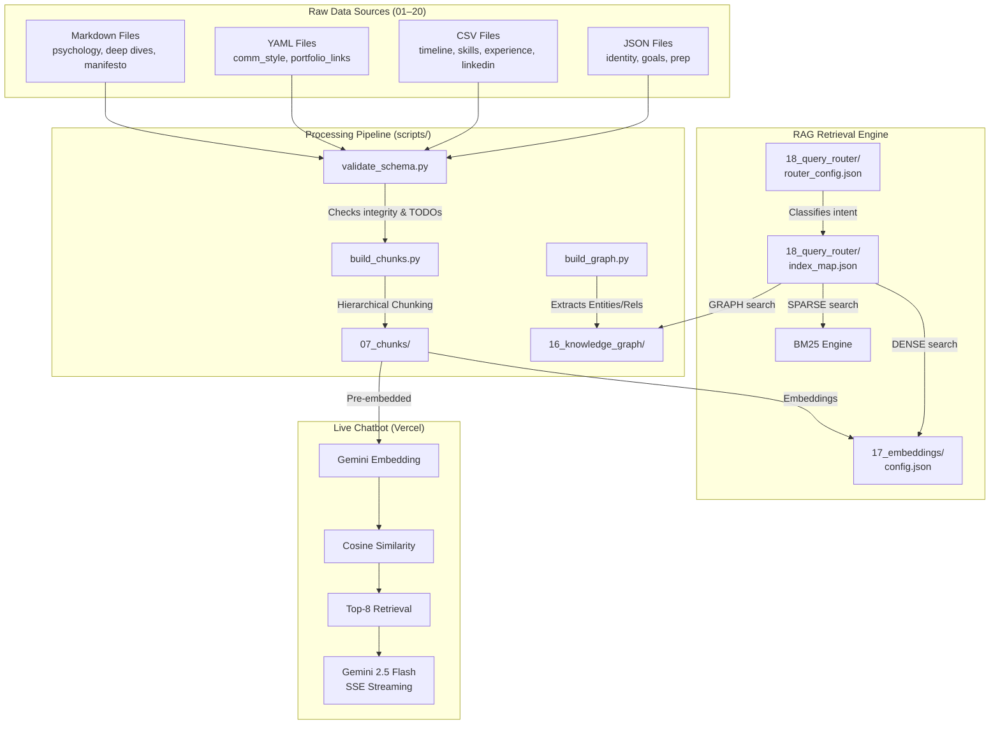

# 🧠 Personal RAG Database — Kankatala Ganesh Giridhar (v3.0.0)

> **Production knowledge base powering a live AI chatbot at [brandofganesh.vercel.app](https://brandofganesh.vercel.app)**

This repository contains the structured, production-grade knowledge base and processing pipeline for an AI-powered **Digital Twin** representing **Kankatala Ganesh Giridhar**. It is optimized for retrieval-augmented generation (RAG), intent-based query routing, hierarchical semantic search, and authentic personality emulation.

The chatbot is live and serves recruiters, collaborators, and visitors with real-time, context-aware answers about Ganesh's skills, projects, experience, and aspirations — powered by **Gemini 2.5 Flash** with **in-memory vector search**.

---

## 1. Live Deployment Architecture

```
┌────────────────────────────┐
│    Portfolio Frontend      │
│  brandofganesh.vercel.app  │
│   (HTML/CSS/JS + Chat UI)  │
└────────────┬───────────────┘
             │ POST /api/chat
             ▼
┌────────────────────────────┐
│  Vercel Serverless Function │
│       api/chat.js          │
│  ┌──────────────────────┐  │
│  │ 1. Embed query       │  │
│  │    (gemini-embedding) │  │
│  │ 2. Cosine similarity │  │
│  │    (in-memory vectors)│  │
│  │ 3. Top-8 retrieval   │  │
│  │ 4. Gemini 2.5 Flash  │  │
│  │    (SSE streaming)   │  │
│  └──────────────────────┘  │
│                            │
│  data/vectors.json (3.4MB) │
│  Pre-embedded RAG chunks   │
└────────────────────────────┘
```

**Key Design Decisions:**
- **Zero-dependency vector search**: No external vector DB — cosine similarity over pre-embedded chunks loaded in-memory at cold start
- **SSE Streaming**: Server-Sent Events for real-time token-by-token response delivery
- **Edge-optimized**: Entire RAG pipeline runs within Vercel's serverless function limits (~50ms cold start)
- **Gemini 2.5 Flash**: Low-latency, high-quality LLM with system instruction injection

---

## 2. System Architecture

This database is structured to support multi-faceted search (dense semantic search, sparse keyword search, and graph traversal) to answer personal, technical, and behavioral questions with absolute accuracy.



---

## 3. Knowledge Graph Statistics

The knowledge graph (`16_knowledge_graph/`) maps Ganesh's entire professional universe into a queryable graph structure.

| Metric | Count |
|--------|-------|
| **Total Nodes (Entities)** | **109** |
| **Total Edges (Relationships)** | **110** |

### Entity Type Distribution

| Entity Type | Count | Description |
|-------------|-------|-------------|
| Skill | 38 | Programming languages, frameworks, tools, methodologies |
| Organization | 20 | Universities, companies, hackathon hosts, certificate issuers |
| Technology | 17 | Tech stack combinations used across projects |
| Project | 15 | Software projects, hackathon submissions, portfolios |
| Certification | 7 | Professional certifications and course completions |
| Role | 6 | Work positions, internships, and ambassadorships |
| Event | 5 | Hackathons, competitions, and public pledges |
| Person | 1 | Kankatala Ganesh Giridhar (central node) |

### Relationship Type Distribution

| Relationship Type | Count | Description |
|-------------------|-------|-------------|
| KNOWS | 38 | Person → Skill proficiency edges |
| USED_IN | 17 | Project → Technology usage edges |
| BUILT | 15 | Person → Project creation edges |
| WORKED_AT | 12 | Person/Role → Organization employment edges |
| LEARNED_FROM | 8 | Certification → Organization learning edges |
| ACHIEVED | 7 | Person → Certification achievement edges |
| PARTICIPATED_IN | 5 | Person → Event participation edges |
| STUDIED_AT | 4 | Person → Organization education edges |
| LOCATED_IN | 4 | Event → Organization venue edges |

---

## 4. Chunk Pipeline Statistics

After running `build_chunks.py`, the pipeline produces:

| Metric | Value |
|--------|-------|
| **Total Chunks** | **399** |
| Child Chunks | 344 |
| Parent Chunks | 40 |
| Hypothetical Q&A Chunks | 15 |
| **Total Tokens** | **58,861** |
| Avg Tokens/Chunk | 147.5 |
| Files Processed | 35 |
| Files Skipped | 0 |
| Categories | 17 |

### Chunks by Category

| Category | Chunks | Description |
|----------|--------|-------------|
| linkedin | 74 | LinkedIn profile, positions, education, projects, skills, media |
| skills | 43 | Technical competencies with proficiency levels |
| experience | 32 | Work history, internships, role deep-dives |
| interview_prep | 31 | Behavioral answers, technical architecture dives |
| timeline | 30 | Chronological life and career events |
| learning | 27 | Courses, certifications, reading list |
| network | 23 | Professional relationships and mentors |
| projects | 21 | 15 projects with tech stacks and metrics |
| identity | 19 | Core bio, elevator pitches, contact info |
| content | 18 | Open-source presence and repositories |
| values_beliefs | 17 | Engineering ethics, Linear Paradigm, failures |
| achievements | 16 | Awards, hackathon placements, certifications |
| goals | 14 | Short, mid, and long-term career roadmap |
| communication_style | 12 | Writing rules, tone profiles, audience targeting |
| psychology | 9 | Cognitive patterns, motivators, resilience |
| portfolio_links | 8 | Portfolio navigation and section URLs |
| prompts | 5 | System prompts, resume builder, interview coach |

---

## 5. Directory Layout & File Catalog

The repository is organized into **20 data directories** plus infrastructure layers:

```
personal-rag-db/
├── 01_identity/                 # Core identity and communications
│   ├── identity.json            # Name, contact info, education, and social URLs
│   ├── communication_style.yaml # Writing rules, tone, and audience profiles
│   └── elevator_pitches.json    # Adaptable personal pitches (30s, 2m, tech, casual)
├── 02_timeline/                 # Chronological milestones
│   └── timeline.csv             # 26 chronological life/career events
├── 03_skills/                   # Detailed competence catalog
│   └── skills.csv               # 38 skills with proficiency levels (1-5) and evidence
├── 04_projects/                 # Tech stack and project specifications
│   └── projects.csv             # 15 projects with metrics, roles, and importance
├── 05_achievements/             # Awards and official records
│   └── achievements.csv         # Certificates, competition scores, and awards
├── 06_psychology/               # Cognitive and personality profiles
│   └── psychology.md            # Mindset, linear paradigm, and motivators
├── 07_chunks/                   # ⚡ Processed outputs for Vector DB import
│   ├── rag_chunks.jsonl         # All 399 chunks (child + parent + Q&A)
│   ├── child_chunks.jsonl       # Fine-grained chunks (200-400 tokens)
│   ├── parent_chunks.jsonl      # Aggregated context chunks (512-1024 tokens)
│   └── chunk_manifest.json      # Processing statistics and checksums
├── 08_prompts/                  # Production-ready LLM system instructions
│   ├── system_prompt.txt        # Core prompt with in-context examples & guardrails
│   ├── resume_builder.txt       # ATS-optimized resume generator instructions
│   └── interview_coach.txt      # Interactive interview prep coach instructions
├── 09_experience/               # Professional history
│   ├── experience.csv           # Work, internship, and research positions
│   └── role_details/            # In-depth logs for key career milestones
│       ├── codsoft.md           # MERN-stack internship breakdown
│       └── live_in_labs.md      # Sustainable rural research details
├── 10_learning/                 # Courses, workshops, and readings
│   ├── reading_list.csv         # Educational courses, self-study, and ratings
│   └── certifications_roadmap.csv # Active roadmap for certifications (e.g., Azure)
├── 11_goals/                    # Professional and personal targets
│   ├── goals.json               # Short (6m), mid (1-2y), and long-term (5y) roadmap
│   └── career_vision.md         # Narrative 5-year vision and value proposition
├── 12_network/                  # Professional relationships (Anonymized)
│   └── network.csv              # Mentors, professors, and partners
├── 13_content/                  # Open-source presence
│   └── open_source.csv          # Index of public GitHub repositories
├── 14_values_beliefs/           # Engineering ethics and philosophies
│   ├── manifesto.md             # The Linear Paradigm and Engineering Morality
│   └── failures_and_lessons.md  # Setbacks analyzed using the STAR-L framework
├── 15_interview_prep/           # Human resources and technical prep kits
│   ├── behavioral_answers.json  # 10 HR behavioral questions with STAR answers
│   └── technical_deep_dives.md  # Detailed design architecture diagrams and explanations
├── 16_knowledge_graph/          # 🔗 Graph database mappings (109 nodes, 110 edges)
│   ├── entities.json            # Extracted node metadata (Person, Org, Tech, etc.)
│   ├── relationships.json       # Directed edges (BUILT, USED_IN, KNOWS, etc.)
│   └── graph_schema.json        # Node and edge schema validation criteria
├── 17_embeddings/               # Embeddings settings
│   └── config.json              # Model, dimensional, and database recommendations
├── 18_query_router/             # Retrieval routing logic
│   ├── router_config.json       # Query intent classifications and mappings
│   └── index_map.json           # Dense/Sparse vector index mapping rules
├── 19_portfolio_links/          # Portfolio website navigation data
│   └── portfolio_navigation_and_links.yaml  # Section URLs and navigation structure
├── 20_linkdeln/                 # 🔵 LinkedIn data export (10 CSV files)
│   ├── Profile.csv              # Headline, summary, location, industry
│   ├── Positions.csv            # Work positions (UNLOX, CodSoft)
│   ├── Education.csv            # Education history
│   ├── Projects.csv             # Project descriptions from LinkedIn
│   ├── Skills.csv               # Endorsed skills list
│   ├── Company Follows.csv      # Companies followed on LinkedIn
│   ├── Email Addresses.csv      # Email addresses
│   ├── Rich_Media.csv           # LinkedIn posts and media content
│   ├── Registration.csv         # Account registration date
│   └── PhoneNumbers.csv         # Phone numbers
├── schemas/                     # Validation schemas
│   ├── identity.schema.json     # JSON schema for validating identity.json
│   └── chunks.schema.json       # JSON schema for validating individual chunks
├── scripts/                     # Automation scripts
│   ├── build_chunks.py          # Processes 35 source files into 399 RAG chunks
│   ├── build_graph.py           # Generates knowledge graph (109 entities, 110 rels)
│   ├── validate_schema.py       # Validates structural integrity and checks for TODOs
│   └── stats.py                 # Outputs a visual database statistics summary
├── CHANGELOG.md                 # Project version control changelog
└── README.md                    # Project documentation (this file)
```

---

## 6. Automation Scripts & Pipelines

All scripts are written in standard Python 3 with **zero external dependencies** to ensure ease of deployment.

### Validate Data Files
Before generating chunks or building the graph, validate that the database is free of placeholders, uses proper CSV delimiters, and follows ISO date formats:
```bash
python scripts/validate_schema.py
```

### Build RAG Chunks
Build child, parent, and hypothetical Q&A chunks with metadata, temporal stamps, token estimates, and SHA-256 checksums:
```bash
# Basic run
python scripts/build_chunks.py

# Verbose run showing all files processed
python scripts/build_chunks.py --verbose
```

### Extract Knowledge Graph
Extract entities and relationships from files to build a structured graph:
```bash
python scripts/build_graph.py
```

### Review Database Statistics
Generate a completion report and chunk distribution heatmap:
```bash
python scripts/stats.py
```

---

## 7. Verification and Schema Checks

The database includes built-in quality control metrics:

| Check | Standard |
|-------|----------|
| **Date Formats** | Strict ISO 8601 (`YYYY-MM-DD`, `YYYY-MM`, or `YYYY`) |
| **CSV Standard** | Comma `,` delimiters with proper quoting; pipes `\|` for in-column lists |
| **No Placeholders** | Zero `TODO`, `placeholder`, or empty values in production data |
| **Chunk Integrity** | SHA-256 checksums per chunk for deduplication and versioning |
| **Token Budgets** | Child chunks: 200–400 tokens; Parent chunks: 512–1024 tokens |

---

## 8. Tech Stack

| Layer | Technology |
|-------|-----------|
| **LLM** | Google Gemini 2.5 Flash |
| **Embeddings** | Gemini Embedding Model (`gemini-embedding-2`) |
| **Vector Search** | In-memory cosine similarity (zero-dependency) |
| **Hosting** | Vercel Serverless Functions |
| **Frontend** | HTML/CSS/JS portfolio with embedded chat UI |
| **Streaming** | Server-Sent Events (SSE) |
| **Data Pipeline** | Python 3 (no external dependencies) |
| **Knowledge Graph** | JSON-based entity-relationship model |

---

## 9. Contributing

This is a personal knowledge base. If you're building your own RAG digital twin, feel free to fork this repository and adapt the pipeline to your data.

---

<p align="center">
  <strong>Built with 🧠 by <a href="https://brandofganesh.vercel.app">Kankatala Ganesh Giridhar</a></strong><br/>
  <em>The Linear Paradigm — consistent daily execution over manufactured turning points.</em>
</p>